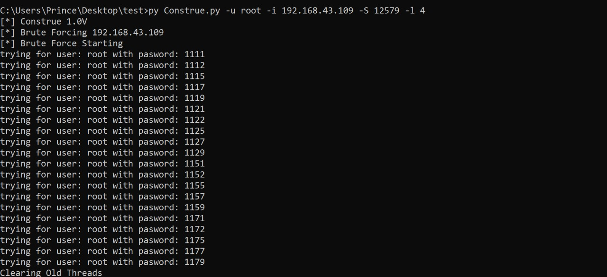
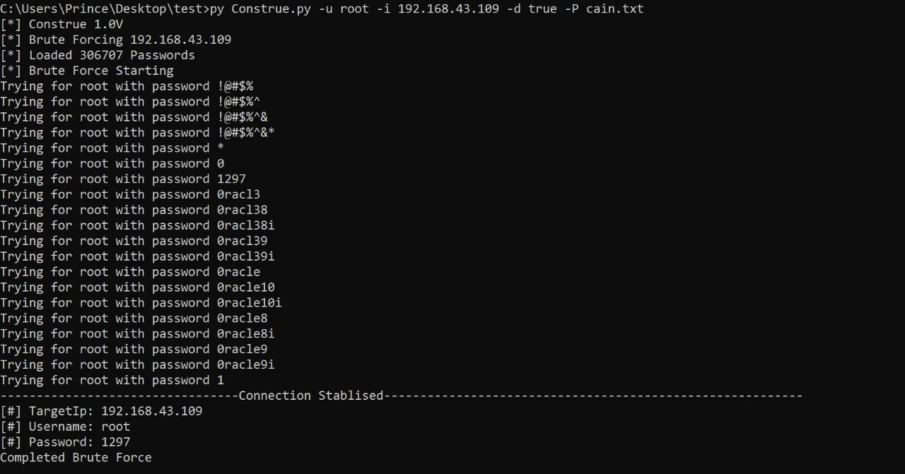
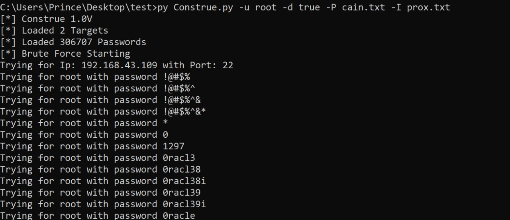
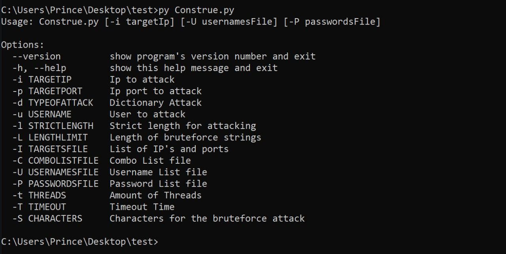

# Construe

Construe is a tool which carries out brute-force and dictionary attacks on a SSH server. It makes use of a optimal data generator using itertools to carry out the brute force attacks and uses multithreading to establish connections with the SSH server using the paramiko API


## Results
**Please note that all the tests have been carried out on our OWN SSH servers and we would ask you to do the same, this project is for educational purposes only.**

**Brute-Force attack on known IP address and known username:**

  


**Dictionary attack on known IP address with a password-text file:**

 

 

**Dictionary attack on multiple known IP addresses(target text file) with a password-text file:**

 

 

## Installations and Downloads

Use the package manager [pip](https://pip.pypa.io/en/stable/) to install the dependencies.

```bash
pip3 install -r requirements.txt
```

This [link](https://drive.google.com/file/d/0B7XkCwpI5KDYNlNUTTlSS21pQmM/edit) contains the **word2vec pre-trained Google News corpus** (3 billion running words) word vector model (3 million 300-dimension English word vectors).

It is mirroring the data from the official word2vec website:
**GoogleNews-vectors-negative300.bin.gz**

Please download this file in the same folder as this project.

## Structure of the project
- The **connection.py** handles multithreaded connections to the SSH server via the paramiko API. 

- The **utils.py** file contains some helper functions 

- The **Construe.py** files contains the code for the attacks and also the argument parsing options. This is the main file.


## Usage

**To view all possible options**
```python
python3 Construe.py
```

 


For the **brute-force attack** 
run this in the terminal
```python
python3 Construe.py -u username -i IPAddr -S character_search_space -l length
```

For the **dictionary attack** 
run this in the terminal
```python
python3 Construe.py -u username d-true -I IPs.txt -P passwords.txt 
```


Try experimenting with other combinations of attack arguments!

## Contributing
Pull requests are welcome. For major changes, please open an issue first to discuss what you would like to change.


## License
[MIT](https://choosealicense.com/licenses/mit/)
